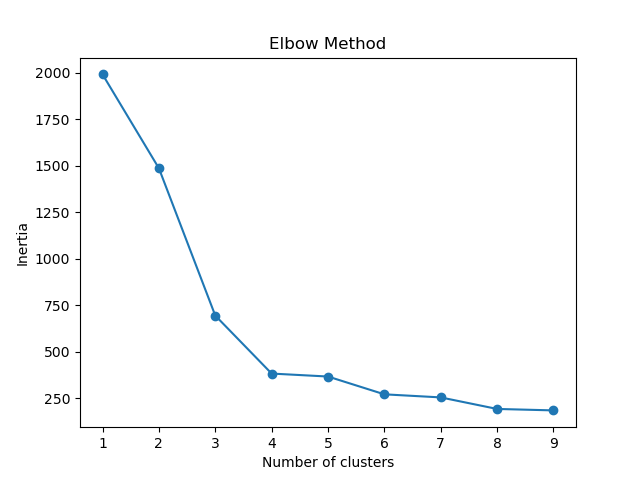
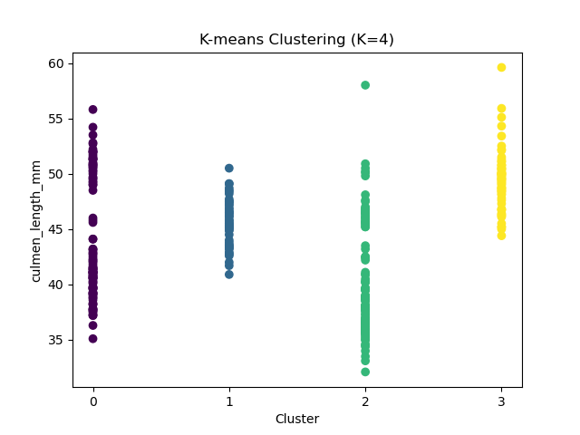

<<<<<<< HEAD
# palmerpenguins-KNN
Based on the work of alisonhorst i made a little cluster agruppation using KNN
=======
# Clustering Antartic Penguin Species


source: @allison_horst <https://github.com/allisonhorst/penguins>

## Overview

You have been asked to support a team of researchers who have been collecting data about penguins in Antartica! The data is available in csv-Format as `penguins.csv`

## Project Structure

```bash
.
├── data
│   └── penguins.csv
├── notebook
│   └── notebook.ipynb
└── README.md
```

---

## Dataset Source

**Origin of this data** : Data were collected and made available by Dr. Kristen Gorman and the Palmer Station, Antarctica LTER, a member of the Long Term Ecological Research Network.

**The dataset consists of 5 columns.**

Column | Description
--- | ---
culmen_length_mm | culmen length (mm)
culmen_depth_mm | culmen depth (mm)
flipper_length_mm | flipper length (mm)
body_mass_g | body mass (g)
sex | penguin sex

Unfortunately, they have not been able to record the species of penguin, but they know that there are **at least three** species that are native to the region: **Adelie**, **Chinstrap**, and **Gentoo**.  Your task is to apply your data science skills to help them identify groups in the dataset!

---

## Workflow

### 1. Exploratory Data Analysis

The initial analysis and preprocessing were performed in:

```bash
./notebook/notebook.ipynb
```

Using the datasets:

```bash
./data/penguins.csv

---

## Installation

Install dependencies:
    dependencies can be found at the notebook in the second line

---

## Running the Project

### Run the EDA Notebook

```bash
jupyter notebook ./notebook/notebook.ipynb
```

## Results





## Inspiration

Based on the DataCamp project.
>>>>>>> c1f0330 (Added info and images)
